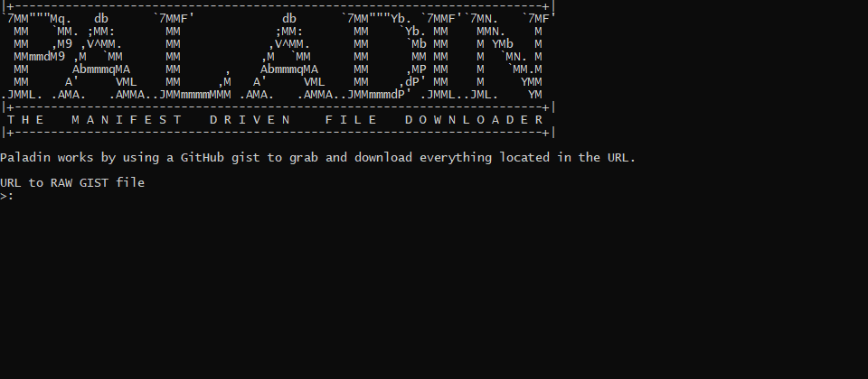
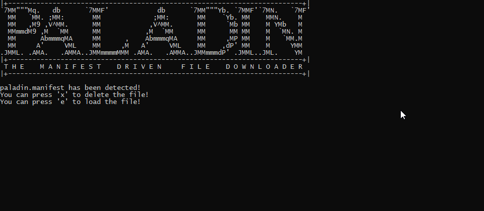

# PALADIN

Paladin is a file downloader that uses a manifest to download any number of files quickly with no user prompts.
The design is simple and revolves around using GitHub Gists (or any RAW TEXT file) to grab all of the links on the file and download it to the active directory.

